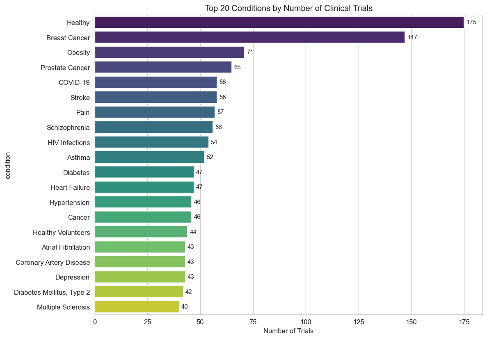
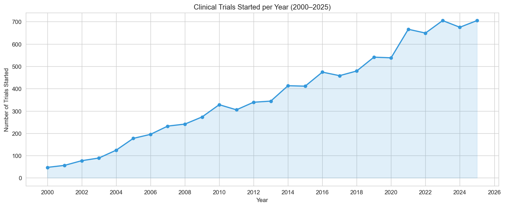

## Clinical Trial Trends Explorer

Exploratory analysis of **10,000 clinical trials** from ClinicalTrials.gov, examining research trends, sponsor patterns, phase completion rates, and geographic distribution.

### Analysis Highlights

| Section | Question |
|---------|----------|
| Trial Status | What proportion of trials complete vs get terminated? |
| Top Conditions | Which diseases receive the most research attention? |
| Volume Over Time | How has trial activity changed from 2000 to 2025? |
| Phase Distribution | Where do trials concentrate in the drug development pipeline? |
| Sponsor Analysis | Industry vs academic — who funds what? |
| Phase by Sponsor | Do pharma companies and universities focus on different phases? |
| Geographic Distribution | Where are trials conducted globally? |
| Enrollment by Phase | How does patient enrollment scale across phases? |
| Trending Conditions | Which conditions are gaining research momentum? |

### Key Findings
- **Cancer dominates** — Breast cancer and prostate cancer are the most studied conditions
- **Academic institutions sponsor ~72% of trials**, but industry leads Phase 3/4 (commercialization)
- **Phase 2 is the bottleneck** — highest volume but lower completion rate than later phases
- **US and China** account for a disproportionate share of global trial activity
- **COVID-19 spike** clearly visible in 2020–2021 trial registrations

### Data Source
[ClinicalTrials.gov API v2](https://clinicaltrials.gov/data-api/about-api) — no API key required.

### How to Run

```bash
pip install -r requirements.txt

# Fetch 10,000 trials from ClinicalTrials.gov API
python src/fetch_trials.py

# Open the notebook
jupyter notebook analysis.ipynb
```

### Sample Visualizations

**Top Conditions**


**Trials Over Time**


### Tools Used
- Python (pandas, matplotlib, seaborn)
- Jupyter Notebook
- ClinicalTrials.gov REST API
- Data analysis and visualization
